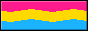

# Malu
 Hello Word!
 Aqui guardo alguns repositórios de estudos e projeto!

<!-- Typing SVG -->

<!-- BADGES LINKS -->
 

 

<!-- BADGES -->

 

 

<!-- SNAKE PEFIL -->

 <picture>
  <source media="(prefers-color-scheme: dark)" srcset="https://raw.githubusercontent.com/MaluWhoo/MaluWhoo/output/github-contribution-grid-snake-dark.svg">
  <source media="(prefers-color-scheme: light)" srcset="https://raw.githubusercontent.com/MaluWhoo/MaluWhoo/output/github-contribution-grid-snake.svg">
  
</picture>

<!-- _generated with [Platane/snk](https://github.com/Platane/snk)_-->
