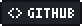

  

 
  

  
  

 

 

 

  
  ### 🚀 Featured Projects

<table>
<tr>
<td width="50%" valign="top">

#### 🛍️ [Virtual Store (Squad)](https://github.com/MaluWhoo/loja-virtual)

Collaborative e-commerce application developed in Angular during the WoMakersCode bootcamp. Features product catalog, wishlist, reactive forms, routing, and API integration.

</td>
<td width="50%" valign="top">

#### ⚙️ [Task Manager API (Squad — In Progress 🚧)](https://github.com/brucarlota/dvteam-api)

Robust RESTful API built in .NET with layered architecture (Controller, Service, Repository), Entity Framework, Migrations, and a strong focus on Back-End best practices.

</td>
</tr>
<tr>
<td width="50%" valign="top">

#### 🏢 [Condominium Management System](https://github.com/MaluWhoo/condominium-management-system)

Web application developed with ASP.NET Core MVC for condominium and resident management, featuring full CRUD operations and PDF report generation.

</td>
<td width="50%" valign="top">

#### 📝 [Task Manager (Angular)](https://github.com/MaluWhoo)

Interactive web application for daily task management. Developed individually applying fundamental concepts of components, data binding, and validations in Angular.

</td>
</tr>
</table>

 
<!--

  
  

 

  <picture>
    <source media="(prefers-color-scheme: dark)" srcset="https://raw.githubusercontent.com/MaluWhoo/MaluWhoo/output/github-contribution-grid-snake-dark.svg">
    <source media="(prefers-color-scheme: light)" srcset="https://raw.githubusercontent.com/MaluWhoo/MaluWhoo/output/github-contribution-grid-snake.svg">
    
  </picture>

<!--

  <picture>
    <source media="(prefers-color-scheme: dark)" srcset="https://raw.githubusercontent.com/MaluWhoo/MaluWhoo/output/github-contribution-grid-snake-dark.svg">
    <source media="(prefers-color-scheme: light)" srcset="https://raw.githubusercontent.com/MaluWhoo/MaluWhoo/output/github-contribution-grid-snake.svg">
    
  </picture>

-->

